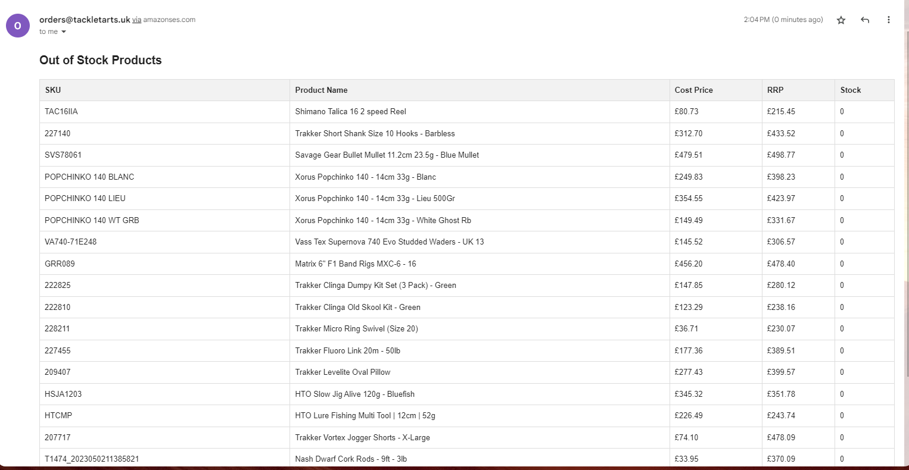
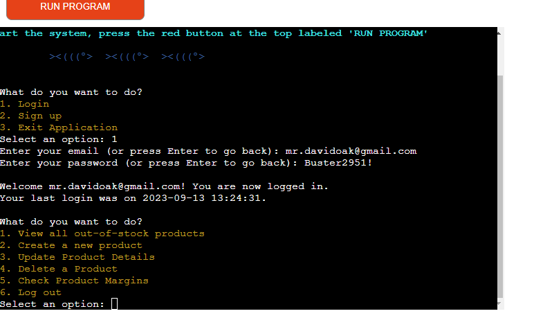
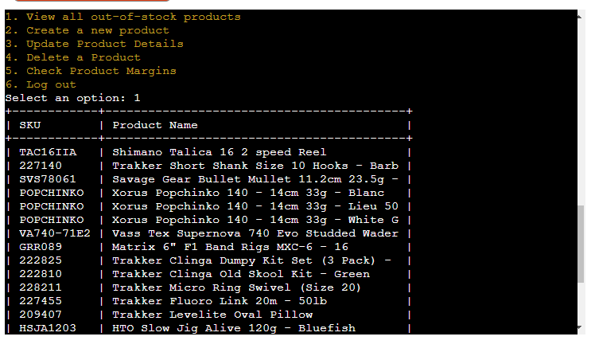
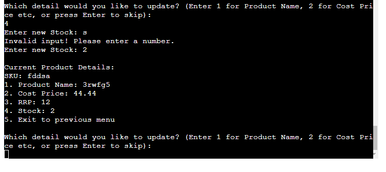

# Fishing Tackle Management System

By David Oak

[Link to live site](https://python-module-3c3f040b0b4c.herokuapp.com/)

## Introduction

A fishing tackle shop spends a lot of time manually updating, creating and managing their fishing tackle products. They have requested from me a CLI based application where they can access their stock management system, which is setup using a Google Sheet. This application must be able to update, create and delete products, as well as have additional functionality such as a login/sign up field for security, and the ability to check margins of products.

They estimate that this will half the time they currently spend managing the Google Sheet manually, which frees up resources for them to invest in growing their business both online and in store.

## Business Requirements

As the end user and the customer are the same, they have given a set of clearly defined requirements the application needs to adhere to:

1. Allow user to login and sign up
2. Validate email and passwords, and give instructions on pw requirements
3. Have a clear and easy to use main menu
4. To be able to check which products are out of stock
5. To be able to email user a list of out of stock products
6. Show last time a user logged in
7. Create a new product with validation for price and stock
8. Update existing products using the SKU as the unique identifier
9. Validate price and stock update fields
10. Delete a product with a double confirmation, using the SKU as the unique identifier
11. Print out a list of all products with their margins, from highest margin to lowest
12. Have a margin filter feature, so the user can filter out/in products above/below a certain margin %, with input validation
13. If an update product is not found, give option to create a new product
14. Fishing tackle product names can be long, make sure any tables printed to the terminal as less than 80 characters in width

## Target Audience

ALthough this application has been designed for a specific online store, any store that uses Google Sheets to manage products can integrate this software. However the sheets must be setup as so:

 **Sheet Name**   | **Column 1 Header**  | **Column 2 Header** | **Column 4 Header** | **Column 5 Header** |
| --------------- | -------------------- | ------------------- | ------------------- | ------------------- |
| products | SKU | Product Name | Cost Price | RRP | Stock |
| user | User | Password | Last Login |
| test_user | User | Password | Last Login |

## Technical Design

### Flowchart

This flowchart was created using Lucidcharts to plot out how the user flows through the app

## Technologies Used

### Languages

* Python was the programming language used for the application
* HTML was used to structure the email content

### Frameworks and Tools

* Lucidcharts for the wireframes
* Googlesheets to host the data
* Googlesheets API to interface with the application and the Googlesheets
* Heroku was used to host the application
* Git was used for version control
* CI Python Linter was used to check PEP8 conformity 
* Github was used for saving files and deploying automatically to Heroku on deployment changes
* AmIresponsive was used to test the application across different devices
* AWS SES was used as the email client

### Python & Third Party Libraries

* re - for checking inputs passed requirements
* os - used to clear terminal
* gspread - a python API for Google Sheets
* prettytable - to build the tables printed in the console
* coverage - to measure how much of the application is being tested via automated unit testing
* colorama - to provide a more interactive interface
* datetime - to store timestamps of logins
* google-auth - to authenticate Googles APIs
* unittest - to build unit testings

## Features

### Main Menu

* Provides welcome note and instructions on how to reset the app
* Allows user to login or create an account
* Differentiate menu colour to improve readability

    
Main Menu

    

  

Solves business requirement 1, 14

### Login/Signup

1. Login - validates email
2. Login - validates password
3. Login - validates whether user exists
4. Login - displays last login time
4. Validates a genunie option (i.e. 1-3) is made, otherwiase asks user to make another choice
5. Sign up - validates email
6. Sign up - checks whether user already exists
7. Sign up - gives password requirements
8. Sign up - requires input password twice
9. Sign up - provides feedback account was created

    
Login/Signup

    
    
    
    
    
    
    

  

Solves business requirements 1, 2, 3, 6

### Product Management Menu

1. Clear and easy to navigate
2. Option to check out of stock products
3. Option to start managing products
4. Option to start deleting products
5. Option to start checking product margins

    
Product Management Menu

    

 

Solves business requirements 3

### Out of stock products

1. View all out of stock products
2. User will want to place an order with the manufacturer for stock, so an email can be send as a table with all the OOS products
3. Option to go back to the main menu
4. Fishing tackle names truncated to save space

    
Out of stock products

    
    
    

 

Solves business requirement 3, 4, 5, 14

### Create new product

1. Creates product using SKU as the unique identifier
2. Checks whether SKU already exists
3. Forces name of product to be more than 3 characters
4. Validates cost price and sales price input is a number, not a string. Also accepts integers and floats
5. Validates stock input is a number, not a string or float
6. Notification that product has been created

    
Create new product

    
    
    
    
    

 

Solves business requirement 7, 9, 3

### Update Product

1. Update based on UID which is SKU
2. If SKU doesn't exist, gives option to create a new product
3. Displays product data before asking what to change
4. Validate stock/price inputs are values not strings
5. Prints product post update
6. Gives option to change other data points, or go back to main menu

    
Update Product

    
    
    
    

 

Solves business requirement 8, 9, 3, 13

### Delete Product

1. Checks to see whether SKU exists, if not exists delete option
2. Prints product data to application
3. Double delete confirmation

    
Delete Product

    
    

 

Solves business requirement 10

#### Check Product Margins

1. Prints all product margins, ranked from highest to lowest
2. Fishing tackle names truncated to save space
3. Validates all inputs
4. Can filter out products above or below a certain margin

    
Check Product Margins

    
    
    

 

Solves business requirement 11, 12, 14

## Testing

### Automated Unit Testing

Pythons unit testing was used to build 19 automated tests. This can be run by executing the unit_tests.py file using python3 unit_tests.py

    
Automated Unit Testing

    

 

1. Email Validation (TestUtilities class):

Validates if a given email is in the correct format.
Checks for presence of @ symbol.
Ensures a domain is present after the @ symbol.
Validates that there is a username before the @ symbol.
Handles empty email inputs.

2. Password Validation (TestPasswordValidation class):

Validates if a password meets specified requirements:
Should be at least 8 characters long.
Must contain at least one uppercase letter.
Must contain at least one lowercase letter.
Should have at least one digit.
Must include at least one special character.
Should not have spaces at the beginning or the end.

3. Integer Input (TestGetIntegerInput class):

Tests the function that retrieves integer inputs from the user.
Handles non-integer values and ensures only integer values are accepted.

4. Password Matching (TestPasswordMatch class):

Checks if two provided passwords match.
Ensures identical passwords are recognized as matches.
Validates that differing passwords are not considered matches.

5. Profit Margin Calculation (TestCalculateProfitMargin class):

Validates the function that calculates profit margins.
Tests positive profit margin scenarios.
Validates zero profit margin cases.
Checks negative profit margin scenarios.

6. User Authentication (TestAuthentication class):

Tests the login functionality.
Validates that a user can successfully log in with correct credentials.
Additionally, the test results are color-coded for clarity:

PASS: Represented in green to indicate a test passed successfully.
FAIL: Shown in red to highlight a test that did not pass.
ERROR: Also in red, this indicates a test that raised an unexpected error.
SKIP: Displayed in yellow to represent tests that were skipped, with reasons provided.

Python's Coverage was also used to understand how much of the applications functionality was being tested. This helped understand what needed to be added to the manual testing

#### PEP8

[PEP8 Python Validator](https://pep8ci.herokuapp.com/) was used to validate the code.

This validator was provided by Code Institute.

No errors were found.

    
authentication.py

    

    
email_service.py

    

    
product_management.py

    

    
run.py

    

    
unit_tests.py

    

    
utilities.py

    

### Manual Testing

Each of the business requirements were manually tested to confirm working functionality

See Results

1. Allow user to login and sign up

| **Feature**   | **Action**                    | **Expected Result**          | **Actual Result** |
| ------------- | ----------------------------- | ---------------------------- | ----------------- |
| User authentication | Try to log in with valid credentials | User successfully logs in | Works as expected |
| User authentication | Try to sign up with a new email and password | User is successfully registered and logged in | Works as expected |

Screenshot

2. Validate email and passwords, and give instructions on pw requirements

| **Feature**   | **Action**                    | **Expected Result**          | **Actual Result** |
| ------------- | ----------------------------- | ---------------------------- | ----------------- |
| Email and Password Validation | Enter an invalid email format during signup/login | Error message about invalid email format | Works as expected |
| Email and Password Validation | Enter a password that doesn't meet requirements | Error message with password requirements | Works as expected |

Screenshot

3. Have a clear and easy to use main menu

| **Feature**   | **Action**                    | **Expected Result**          | **Actual Result** |
| ------------- | ----------------------------- | ---------------------------- | ----------------- |
| Main menu | View main menu after logging in | Clear options presented for various functionalities | Works as expected |

Screenshot

4. To be able to check which products are out of stock

| **Feature**   | **Action**                    | **Expected Result**          | **Actual Result** |
| ------------- | ----------------------------- | ---------------------------- | ----------------- |
| Product Stock | Check out-of-stock products | List of out-of-stock products displayed | Works as expected |

Screenshot

5. To be able to email user a list of out of stock products

| **Feature**   | **Action**                    | **Expected Result**          | **Actual Result** |
| ------------- | ----------------------------- | ---------------------------- | ----------------- |
| Email Service | Request email of out-of-stock products | Email with list of out-of-stock products sent to user | Works as expected |

Screenshot

6. Show last time a user logged in

| **Feature**   | **Action**                    | **Expected Result**          | **Actual Result** |
| ------------- | ----------------------------- | ---------------------------- | ----------------- |
| User Activity | Log in | Display message showing the last time user logged in | Works as expected |

Screenshot

7. Create a new product with validation for price and stock

| **Feature**   | **Action**                    | **Expected Result**          | **Actual Result** |
| ------------- | ----------------------------- | ---------------------------- | ----------------- |
| Product Management | Create new product with valid details | Product successfully added with validation checks for price and stock | Works as expected |

Screenshot

8. Update existing products using the SKU as the unique identifier

| **Feature**   | **Action**                    | **Expected Result**          | **Actual Result** |
| ------------- | ----------------------------- | ---------------------------- | ----------------- |
| Product Management | Update product using SKU | Product details updated successfully | Works as expected |

Screenshot

9. Validate price and stock update fields

| **Feature**   | **Action**                    | **Expected Result**          | **Actual Result** |
| ------------- | ----------------------------- | ---------------------------- | ----------------- |
| Product Management | Update product's price or stock with invalid data | Error message displayed with validation checks | Works as expected |

Screenshot

10. Delete a product with a double confirmation, using the SKU as the unique identifier

| **Feature**   | **Action**                    | **Expected Result**          | **Actual Result** |
| ------------- | ----------------------------- | ---------------------------- | ----------------- |
| Product Management | Request deletion of product using SKU and confirm twice | Product successfully deleted after double confirmation | Works as expected |

Screenshot

11. Print out a list of all products with their margins, from highest margin to lowest

| **Feature**   | **Action**                    | **Expected Result**          | **Actual Result** |
| ------------- | ----------------------------- | ---------------------------- | ----------------- |
| Product Margins | View product margins | List of products displayed with margins in descending order | Works as expected |

Screenshot

12. Have a margin filter feature, so the user can filter out/in products above/below a certain margin %, with input validation

| **Feature**   | **Action**                    | **Expected Result**          | **Actual Result** |
| ------------- | ----------------------------- | ---------------------------- | ----------------- |
| Product Margins | Filter products by margin percentage | Products displayed based on margin filter with input validation | Works as expected |

Screenshot

>

13. If an update product is not found, give option to create a new product

| **Feature**   | **Action**                    | **Expected Result**          | **Actual Result** |
| ------------- | ----------------------------- | ---------------------------- | ----------------- |
| Product Management | Try to update a non-existent product by SKU | Option given to create a new product | Works as expected |

Screenshot

14. Fishing tackle product names can be long, make sure any tables printed to the terminal are less than 80 characters in width

| **Feature**   | **Action**                    | **Expected Result**          | **Actual Result** |
| ------------- | ----------------------------- | ---------------------------- | ----------------- |
| Product Display | View product names in terminal | Product names displayed in terminal are within 80 characters in width | Works as expected |

Screenshot

## Bugs and Fixes

| Bug Description  | Action Taken to Fix  |
|---|---|
| Print margins would not print due to inconsistencies in data types in the function. | The function will handle both float and integer values by converting them to floats, as well as clean strings that represent prices. |
| Users would be asked to login after creating an account. | User is now automatically logged in after creating an account. |
| If a user input an incorrect password, it would start the login/signup process from the beginning. | The user is prompted to input the password again, not start from the top. |
| No option to exit from the check margins menu. | Added option to return to main menu. |
| The system would not check if the SKU exists before creating a new one. | The application now checks existing SKUs to remove the chance of product duplication. |

### Unfixed Bugs

* No bugs remain after extensive testing

## Deployment

The application has been setup to autodeploy to Heroku when an updated version is pushed to Github

This was acheived by:

#### Step 1

* Create an account at Herku and login

Heroku Login

#### Step 2

* Create a new app

Create App

#### Step 3

 * Input config vars
 * Go to Heroku app settings
 * Scroll to config vars
 * input new config vars PORT = 8000 and CREDS = content of the creds.json file, where the API connection details are all saved

Config Vars

#### Step 4

* Click on "Add Buildpack" button in the Buildpacks area of the app settings page
* Add a python and a nodejs buildpack

Buildpack

#### Step 5

* Connect the app to the Github repo
* Make sure "Enable Automatic Deploys" is checked
* Now everytime a new version is pushed to Github, it will automatically redeploy the app
* You have the option to press the "Deploy Branch" in the Manual deploy area if you want to manually deploy the lastest Github version again

Create App

### Forking the GitHub Repository
1. Go to the GitHub repository https://github.com/ouzifeng/CI_PP3_PYTHON
2. Click on Fork button in top right corner
3. You will then have a copy of the repository in your own GitHub account.
   
### Making a Local Clone
1. Go to the GitHub repository 
2. Locate the Code button above the list of files and click it
3. Highlight the "HTTPS" button to clone with HTTPS and copy the link
4. Open Git Bash
5. Change the current working directory to the one where you want the cloned directory
6. Type git clone and paste the URL from the clipboard ($ git clone https://github.com/YOUR-USERNAME/YOUR-REPOSITORY)
7. Press Enter to create your local clone

